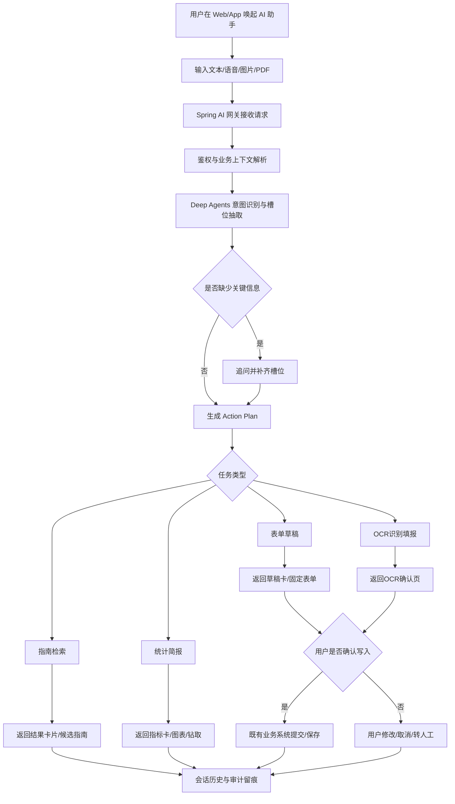
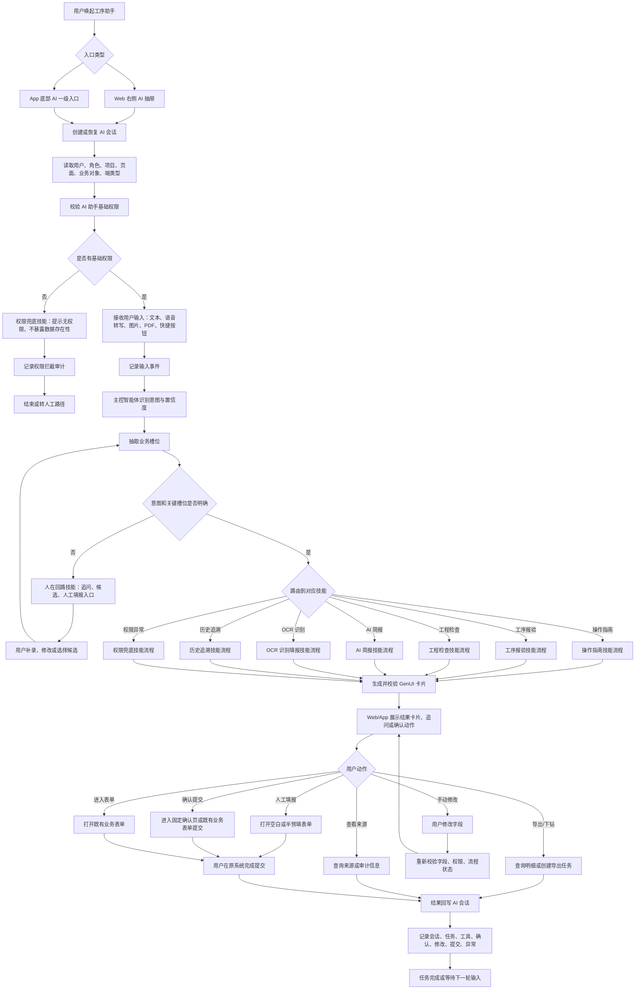
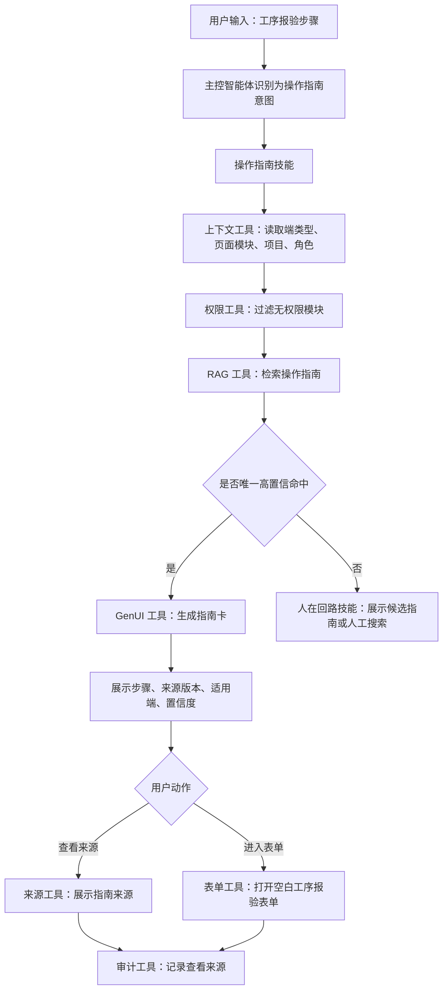
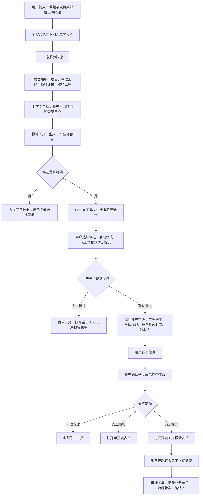
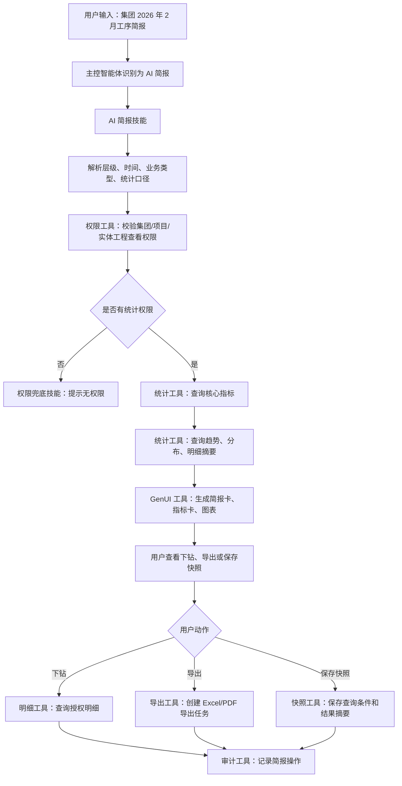
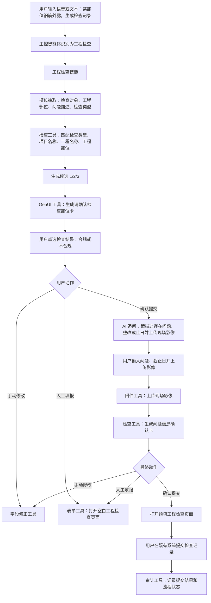
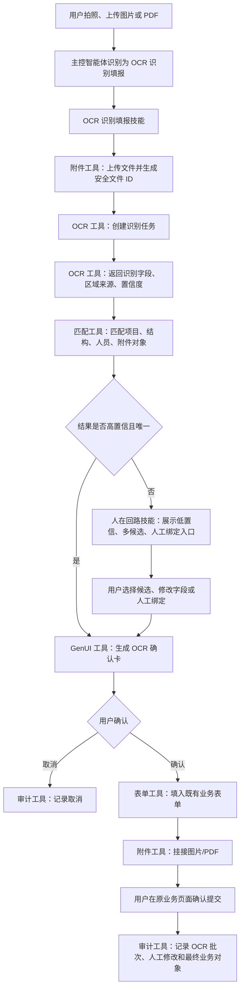
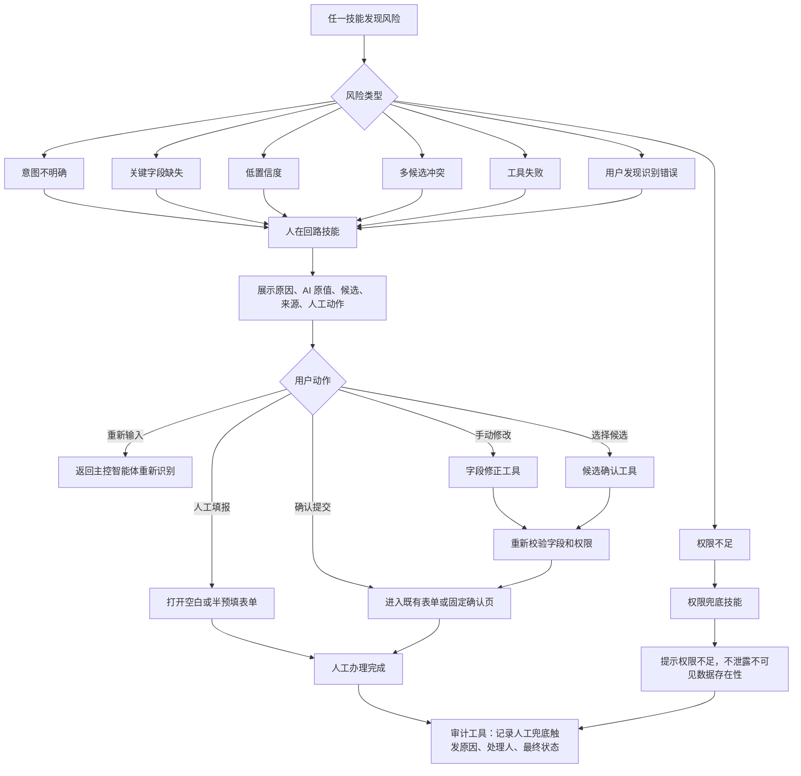
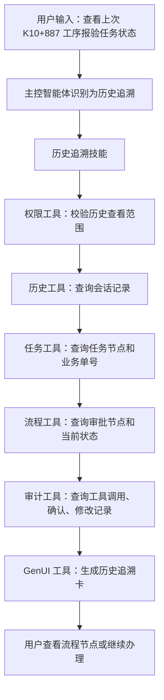

# 工序管控系统 AI 助手（Agent）PRD 正式版

## 1. 文档信息

| 项目 | 内容 |
|---|---|
| 文档名称 | 工序管控系统 AI 助手（Agent）产品需求文档 |
| 文档版本 | V1.0 |
| 文档状态 | 正式版 |
| 编制日期 | 2026-07-05 |
| 适用阶段 | 一期建设、设计评审、研发实现、测试验收、上线准备 |
| 适用终端 | Web 端、App 端 |
| 目标系统 | 既有工序管控系统 |
| 建议研发标签 | ready-for-agent |
| 主要输入 | 主线程讨论、Grilling 子线程 01-09、多领域澄清合并版需求说明书、OCR 场景细化版需求说明书、AI Coding 开发规格说明 |
| 输出形式 | Markdown PRD、Word PRD |

### 1.1 修订记录

| 版本 | 日期 | 状态 | 修订说明 |
|---|---|---|---|
| V1.0 | 2026-07-09 | 正式版 | 根据已讨论需求生成规范化 PRD，统一 AI 助手一期范围、业务流程、功能需求、交互、数据、权限、集成、技术约束、验收标准和项目计划。 |

### 1.2 文档目的

本文档用于明确工序管控系统 AI 助手一期建设的产品需求边界，作为产品评审、UI/交互设计、架构设计、研发排期、测试验收和上线交付的统一依据。本文档描述产品要实现的业务能力、用户体验、数据要求、系统集成和验收口径，不替代详细设计、接口设计和测试用例，但研发实现不得偏离本文档明确的业务范围。

### 1.3 术语说明

| 术语 | 说明 |
|---|---|
| AI 助手 | 工序管控系统内统一的智能交互入口，提供问答、指南检索、数据简报、OCR 识别、表单草稿和流程导航能力。 |
| Agent | AI 助手背后的任务编排能力，负责意图识别、槽位抽取、追问、工具调用、结果组织和审计事件输出。 |
| Deep Agents | 一期采用的独立 Python Agent 编排服务。 |
| Spring AI 网关 | 既有 Spring 业务系统内新增的 AI 统一入口与工具网关，负责鉴权、上下文、工具白名单、业务接口调用和审计。 |
| RAG | 检索增强生成，用于操作指南、制度规范、知识片段检索。 |
| GenUI | 受控 UI schema 生成能力，用于卡片、步骤、追问、摘要和确认内容渲染。 |
| OCR | 图片/PDF 文本识别与结构化提取能力。 |
| 报验/验收 | 工序验收申请及审批相关业务。 |
| 检查 | 项目检查记录、检查台账及问题状态相关业务。 |
| 四级层级 | 集团、直属单位、项目、实体工程。 |
| 槽位 | AI 从自然语言中抽取的业务参数，如项目、桩号、工程部位、时间范围、统计层级、人员等。 |
| 人在回路 | AI 无法确定结果、结果置信度低、候选冲突或涉及正式写入时，由用户或授权人员完成确认、修正、补录、人工绑定或转人工办理的闭环机制。 |
| 人工兜底 | AI、RAG、OCR、工具调用或模型服务无法给出可靠结果时，系统保留原人工业务路径，并记录失败原因、人工处理结果和审计信息。 |

## 2. 项目背景

现有工序管控系统已经具备 Web 端、App 端、验收/报验管理、检查管理、检查台账、多维报表、附件照片、项目结构、人员权限等基础能力。随着现场作业和管理分析深度增加，用户在操作效率、数据获取、资料录入和流程闭环方面出现明显瓶颈。

现场作业人员在发起验收申请、提交检查记录、查找操作指南时，需要在多个菜单、实体结构层级和表单之间切换。项目名称、桩号、工程部位、施工单位、人员信息、隐患描述等字段仍大量依赖人工查找和录入，操作链路长、重复输入多，影响现场作业效率。

管理人员需要快速掌握集团、直属单位、项目、实体工程四级层级下的报验和检查情况，但目前通常需要手动选择层级、时间、状态和筛选条件，无法通过自然语言快速获得累计、月度、季度、年度统计简报，也难以在简报、明细、导出和历史复盘之间形成自然闭环。

现场照片、白板、重点监管责任登记卡、线下附件等资料包含大量可复用信息，但现阶段仍主要依赖人工查看、录入和挂接。桩号、工程部位、责任人、施工单位、附件名称等信息容易录错、漏填或与系统结构绑定不准确。

因此，本项目拟在既有工序管控系统之上建设统一 AI 助手，通过多模态交互、RAG 检索、OCR 识别、受控 Agent 编排和业务系统集成，实现“交互、识别、跳转、填充、确认、闭环”的智能作业链路。

## 3. 项目目标

### 3.1 总体目标

建设一个覆盖 Web 端和 App 端的统一 AI 助手入口，在不改变既有业务权威规则和审批流程的前提下，为现场作业人员、项目管理人员、集团/直属单位管理人员提供自然语言问答、操作指南检索、业务表单直达、报验/检查数据简报、OCR 自动识别填充、历史追溯和审计留痕能力。

### 3.2 业务目标

1. 降低现场作业操作成本：用户可通过文字、语音、图片/PDF 等方式发起任务，减少菜单查找、层级点击和重复录入。
2. 提升业务办理效率：验收申请、检查记录等常用流程可由自然语言触发表单草稿，用户确认后进入既有业务表单提交。
3. 提升管理数据获取效率：支持四级层级报验/检查统计问答，快速生成简报、图表、明细钻取、导出和历史快照。
4. 提升资料录入准确性：通过 OCR/视觉识别提取白板、责任登记卡、附件中的关键字段，并与系统项目、结构、人员数据匹配。
5. 保持业务安全可控：AI 只生成建议、草稿、解释或受控 UI schema，正式写入必须由当前登录用户确认，权限和流程仍以既有业务系统为准。
6. 建立人在回路和人工兜底机制：当意图识别、槽位抽取、RAG 检索、OCR 识别、候选匹配或工具调用无法形成可靠结果时，系统必须停止自动推进，并引导用户确认、修正、补录、人工绑定或转入既有人工办理流程。

### 3.3 量化目标

| 指标 | 一期目标 |
|---|---|
| 常见操作指南定位效率 | 用户输入问题后可返回候选指南或明确无结果提示，减少人工菜单查找时间。 |
| 表单发起效率 | 对信息完整的验收申请/检查记录指令，自动生成草稿并进入确认或表单页面。 |
| 报验/检查简报效率 | 支持按集团、直属单位、项目、实体工程四级层级生成统计摘要和可视化数据。 |
| OCR 减少录入 | 对清晰图片/PDF 自动提取关键字段并生成可确认结果，减少重复录入。 |
| 写操作确认率 | AI 触发的正式业务写入动作必须 100% 经过用户显式确认。 |
| 权限拦截 | 越权访问、跨项目无权限数据、不可见对象存在性泄露必须被拦截。 |
| 主流程影响 | AI 服务异常不得影响人工业务主流程。 |
| 低置信拦截 | 低置信度、无结果、多候选冲突、字段缺失场景不得自动写入业务结果。 |
| 人工兜底闭环 | 进入人工兜底的任务必须可继续办理、可查询状态、可追溯原因和最终处理结果。 |

### 3.4 成功标准

1. Web 端和 App 端均可使用统一会话体系、任务节点模型、历史记录和审计链路。
2. 操作指南问答、表单草稿、数据简报、OCR 填报四类核心任务可完整闭环。
3. 所有工具调用经过 Spring 工具网关鉴权和白名单控制。
4. 所有正式业务写入动作均由用户在固定确认页或既有业务表单中完成。
5. 测试验收可通过功能、权限、安全、性能、异常和审计证据包验证。

## 4. 用户与场景

### 4.1 用户角色

| 角色ID | 角色 | 典型诉求 | 核心能力 |
|---|---|---|---|
| Role-001 | 现场作业人员 | 快速查询操作步骤、发起验收申请、提交检查记录、上传照片/OCR | 指南问答、表单直达、拍照识别、草稿确认、任务状态查看 |
| Role-002 | 项目管理人员 | 查看项目简报、核对填报结果、追踪流程状态、处理异常 | 项目统计、明细钻取、OCR 结果复核、异常处理 |
| Role-003 | 集团/直属单位管理人员 | 获取多项目统计、趋势分析、导出报表、复盘管理情况 | 四级简报、跨项目汇总、导出、历史快照 |
| Role-004 | 项目管理/监管负责人 | 识别监管资料、核对结构与人员绑定、查看重点任务 | 重点监管 OCR、结构匹配、人员匹配、任务追溯 |
| Role-005 | 系统管理员 | 统一负责业务配置、系统配置、账号权限、接口限流、审计查询、AI 服务运维和供应商协同 | 字段模板、匹配规则、GenUI 白名单、配置发布/回滚、权限映射、审计查询、监控告警、日志分析、模型/OCR/RAG/Deep Agents 故障排查 |

### 4.2 核心用户场景

| 场景ID | 场景 | 触发入口 | 用户价值 |
|---|---|---|---|
| Scene-001 | 操作指南问答 | Web AI 侧边栏、App AI 一级入口 | 快速获得与当前业务一致的操作步骤和候选入口。 |
| Scene-002 | 自然语言发起验收申请 | Web 侧边栏、App AI 助手 | 根据项目、桩号、工程部位等信息生成验收申请草稿。 |
| Scene-003 | 自然语言发起检查记录 | Web 侧边栏、App AI 助手 | 根据检查对象、问题描述、人员等信息生成检查记录草稿。 |
| Scene-004 | 四级层级数据简报 | Web 侧边栏、App AI 助手 | 通过自然语言生成报验/检查统计卡片、图表和明细。 |
| Scene-005 | 白板照片识别 | App 拍照/相册、AI 助手 | 提取桩号、工程部位、施工节点等信息并自动填充表单。 |
| Scene-006 | 重点监管资料 OCR | Web 上传图片/PDF、表单上传入口 | 从责任登记卡、附件等资料提取结构、人员、单位和附件信息。 |
| Scene-007 | 历史会话与任务追溯 | Web/App AI 历史入口 | 追溯提问、结果、来源、确认、提交和异常信息。 |
| Scene-008 | 权限不足与异常兜底 | 任意 AI 任务 | 清晰提示无法办理原因，保留人工处理路径。 |
| Scene-009 | 人在回路与人工兜底 | 验收申请、检查记录、OCR确认页、AI会话错误卡 | 当 AI 无法可靠识别、候选冲突、低置信度或工具失败时，用户可确认、修正、补录、人工绑定、转表单手工办理或转管理员处理。 |

### 4.3 典型用户故事

1. 作为现场作业人员，我想输入“工序报验步骤”，以便快速看到对应操作指南和表单入口。
2. 作为现场作业人员，我想输入“发起 XX 项目 K10+887 路基验收申请”，以便系统生成验收申请草稿并跳转表单。
3. 作为现场作业人员，我想通过语音描述检查问题，以便系统生成检查记录草稿并引导我补齐缺失字段。
4. 作为现场作业人员，我想拍摄白板照片，以便自动识别桩号、工程部位和施工节点并填入表单。
5. 作为项目管理人员，我想查询“本季度不合格检查记录”，以便快速掌握问题数量、明细和状态。
6. 作为集团管理人员，我想输入“集团 2026 年 2 月工序简报”，以便系统按四级层级汇总报验/检查情况。
7. 作为监管负责人，我想上传责任登记卡或当前文件，以便系统自动识别人员、结构和附件并生成确认结果。
8. 作为系统管理员，我想维护字段模板、匹配规则和 GenUI 白名单，以便 OCR、表单填充和受控 UI 适配业务配置变化。
9. 作为系统管理员，我想查看 AI 调用审计、失败记录和运维日志，以便追踪问题、排查服务故障和控制风险。
10. 作为现场作业人员，当 AI 无法识别我的验收或检查请求、识别错误或置信度较低时，我想看到明确原因和可操作的人工处理入口，以便继续完成验收申请、检查记录或资料挂接。

## 5. 需求范围

### 5.1 一期范围

| 编号 | 范围项 | 说明 |
|---|---|---|
| Scope-001 | 统一 AI 入口 | Web 右侧可折叠 AI 侧边栏；App 底部一级 AI 入口。 |
| Scope-002 | 多模态输入 | 文本输入、语音转写入口、基础附件/图片上传、App 拍照/相册。 |
| Scope-003 | 会话与任务 | 统一会话容器、任务节点、结果卡片、历史会话、审计链路。 |
| Scope-004 | 操作指南问答 | RAG 检索操作指南，返回候选指南、来源、版本、关联业务入口。 |
| Scope-005 | 表单草稿 | 自然语言生成验收申请和检查记录草稿，进入固定表单或确认页。 |
| Scope-006 | 数据简报 | 支持报验/检查四级层级统计、核心指标、钻取、导出、历史快照。 |
| Scope-007 | OCR 填报 | App 白板/责任登记卡照片识别；Web 图片/PDF OCR；确认页；表单自动填充。 |
| Scope-008 | 受控 GenUI | 输出卡片、步骤、数据简报、追问表单、确认摘要和草稿建议的 UI schema。 |
| Scope-009 | Agent 编排 | Deep Agents Python 服务、Spring AI 网关、既有 RAG、OCR 服务接入。 |
| Scope-010 | 安全审计 | 权限映射、工具白名单、日志审计、配置版本、失败兜底。 |
| Scope-011 | 人在回路与人工兜底 | 低置信度、无结果、多候选冲突、识别错误、工具失败时，支持用户确认、修改、补录、人工绑定、转人工办理和结果追溯。 |

### 5.2 不包含范围

| 编号 | 不包含项 | 说明 |
|---|---|---|
| Out-001 | Dify 工作流 | 一期不建设 Dify 工作流。 |
| Out-002 | 知识库内容制作后台 | 一期不建设新的知识库内容制作后台。 |
| Out-003 | AI 代办审批 | 一期不实现 AI 代办审批、撤回、整改闭环、复验、删除、批量提交。 |
| Out-004 | 全自动填报 | 一期不实现无需人工确认的全自动填报。 |
| Out-005 | 任意版式 PDF 全文结构化 | 一期只做限定场景 OCR，不做通用 PDF 结构化平台。 |
| Out-006 | OCR 自动新增基础库 | OCR 不自动新增项目、结构、人员基础库。 |
| Out-007 | 跨项目无权限识别归档 | 无权限项目或数据不可识别、不可归档、不可泄露存在性。 |
| Out-008 | 自定义 SQL/指标 | 不开放自定义 SQL、自定义指标公式、权限条件修改、统计口径修改。 |
| Out-009 | 任意前端代码生成 | GenUI 不输出任意 HTML、JS、Vue 代码或动态脚本。 |
| Out-010 | 独立 LLM 网关 | 一期不建设独立 LLM 网关。 |
| Out-011 | 完整推理持久化 | 不持久化每个 token 或完整中间推理。 |

### 5.3 优先级

一期三类核心业务场景统一纳入同一开发周期，不再按场景一、场景二、场景三划分优先级。研发可按技术依赖拆分迭代，但最终验收需整体闭环。

## 6. 总体业务流程

### 6.1 总体流程



上述总体流程描述用户从 Web/App 入口发起任务到结果卡片、业务确认和审计留痕的端到端链路。为便于研发明确 Deep Agents、技能包和受控工具之间的职责边界，补充以下“技能与工具主流程图”。该图强调：主控智能体只做会话编排、意图路由和安全决策；技能包负责具体业务流程；工具层负责调用既有系统、RAG、OCR、统计、附件和审计服务。

#### 6.1.1 Deep Agents 技能与工具主流程



### 6.2 操作指南与表单联动流程

1. 用户在 Web 右上角点击 AI 助手图标打开右侧抽屉，或在 App 底部一级 AI 入口进入智能填报会话。
2. AI 助手首先显示开场白，说明已接入当前项目、角色权限与工序业务上下文，并提示所有写入动作需用户确认。
3. 用户输入“工序报验步骤”等操作问题，或点击底部快捷按钮“操作指南”后再发送问题。
4. 系统识别为操作指南问答，调用 RAG 返回与当前端、当前模块和权限一致的操作指南卡片，卡片需展示步骤、来源版本、适用端和置信度。
5. 指南卡片提供“查看来源”和“进入表单”动作；点击“查看来源”展示指南来源与审计信息，点击“进入表单”跳转 App 端原系统工序报验页面。
6. 从指南进入的工序报验页面必须为空白或待人工填选状态，单位工程、验收部位、验收工序、工程进度、自检描述、计划验收时间、验收人等字段均由用户人工选择或填写。
7. 用户在 App 原系统表单点击返回时，必须回到进入表单前的 AI 对话内容，保留用户问题、指南回答、来源卡片和输入框状态。
8. 若用户输入的是自然语言办理指令，系统不直接写入，而是先展示候选草稿、手动修改、人工填报、确认提交等人在回路动作，再进入既有业务表单或确认页。

#### 6.2.1 操作指南技能与工具流程

操作指南技能用于处理“怎么操作”“去哪办理”“某业务步骤是什么”等咨询类任务。技能调用 RAG 和来源工具生成可追溯指南卡，并按权限展示“查看来源”“进入表单”等动作。



#### 6.2.2 工序报验技能与工具流程

工序报验技能用于处理自然语言发起验收申请。技能只生成候选、追问补充字段和预填建议，不直接保存或提交正式报验数据；最终提交必须进入既有 App/Web 表单或固定确认页。



### 6.3 AI问数/数据简报

1. 用户在 Web/App AI 助手输入“集团 2026 年 2 月工序简报”等自然语言统计指令。
2. AI 解析统计层级、时间范围、业务类型、状态筛选和组织/项目范围；条件不完整时先追问，不生成含糊简报。
3. Spring 工具网关基于当前用户权限调用固定统计接口，不允许 Agent 直接拼接 SQL 或绕过既有数据权限。
4. 系统返回报告式简报卡片，而不是只返回数字：卡片需包含标题、统计时间、整体使用概况、各单位使用详情、问题与建议等文字说明。
5. 简报卡片同时展示核心指标，例如报验申请、已验收工序、检查问题、不合格数量和占比等，并标注同比/环比或状态说明。
6. 简报卡片至少支持柱状图、折线图、饼图等多种可视化，用于表达单位对比、趋势变化和结构占比。
7. 用户可点击“下钻明细”“导出”等动作查看授权范围内明细、下载报表或保存历史快照。
8. 简报生成结果需进入历史会话，可追溯统计条件、数据口径、生成时间、图表 schema 和导出任务。

#### 6.3.1 AI 简报技能与工具流程

AI 简报技能用于处理集团、直属单位、项目、实体工程四级层级的数据查询。Deep Agents 只解析层级、时间和统计意图，具体指标必须通过固定统计工具查询，不允许 Agent 自行拼接 SQL 或变更统计口径。



### 6.4 工程检查与图片识别填报流程

1. 用户可通过 App 语音、拍照/相册、Web 上传图片/PDF，或在 AI 助手点击“工程检查”快捷按钮发起检查类任务。
2. 系统识别为工程检查或图片识别任务后，结合当前项目、工程名称、工程部位、检查类型和页面上下文生成候选检查卡片。
3. 候选卡片默认仅展开候选 1，候选 2、候选 3 折叠展示；用户可点击“展开全部候选”查看全部候选，避免对话区过长。
4. 每个候选卡片展示检查类型、项目名称、工程名称、工程部位、检查结果和匹配度，并提供“手动修改”“人工填报”“确认提交”三个动作。
5. 点击“人工填报”时，系统跳转 App 端原系统工程检查页面，检查类型、工程名称、工程部位、问题描述、整改要求、整改期限、整改责任人等字段为空白或待人工填选。
6. 点击“确认提交”后，AI 先追问或接收补充信息，例如存在问题、整改截止日和现场影像；补齐后展示“问题信息确认”卡片。
7. 用户在“问题信息确认”卡片点击“确认提交”后，系统跳转 App 端原系统工程检查页面，并将对话内容预填到相应字段，包括异常结果、存在问题、整改要求、整改期限、现场影像和整改责任人。
8. 现场影像在确认卡和原系统页面中应展示缩略图或占位图；低置信度、字段冲突或无匹配对象时必须保留人工修改、人工填报或人工绑定入口。
9. 所有工程检查写入动作仍由既有工程检查页面和业务服务完成，AI 只负责生成候选、追问补齐、预填建议和审计记录。

#### 6.4.1 工程检查技能与工具流程

工程检查技能用于处理自然语言、语音转写或图片上下文触发的检查记录任务。技能先确认检查部位和检查结果，再追问存在问题、整改截止日和现场影像，最后进入既有工程检查页面。



#### 6.4.2 OCR 识别填报技能与工具流程

OCR 识别填报技能用于处理 App 白板照片、Web 图片/PDF、责任登记卡等资料。OCR 结果必须展示识别值、建议值、置信度、来源区域和候选项；低置信度或无唯一匹配时必须进入人工确认。



### 6.5 异常兜底流程

| 异常类型 | 处理要求 |
|---|---|
| 意图无法识别 | 返回可理解提示，并提供可选任务类型。 |
| 槽位缺失 | 追问缺失字段，不得直接写入。 |
| 权限不足 | 不暴露不可见项目或数据存在性，提示权限不足和申请路径。 |
| RAG 无结果 | 返回未匹配到指南，并提供人工入口或关键词建议。 |
| OCR 低置信度 | 要求人工复核，不自动填充高风险字段。 |
| 匹配候选冲突 | 展示候选项，由用户选择后继续。 |
| 工具超时/失败 | 可重试一次，仍失败则进入人工处理。 |
| AI 服务不可用 | 不影响既有业务页面和人工操作流程。 |

### 6.6 人在回路与人工兜底流程

人在回路不是异常之外的附加能力，而是 AI 助手办理验收申请、检查记录、OCR 填报和数据查询时的安全闭环。系统只在结果可靠、权限明确、字段完整且用户确认后继续推进；任一关键条件不满足时，必须转入人工确认、修正、补录或人工办理。

#### 6.6.1 人在回路技能与工具流程

人在回路技能是所有业务技能共用的安全闭环能力。只要出现意图不明确、关键字段缺失、低置信度、多候选冲突、用户发现识别错误或工具失败，系统都必须停止自动推进，转为用户确认、修正、补录、人工绑定或转表单手工办理。



#### 6.6.2 触发条件

| 触发条件 | 示例 | 系统行为 |
|---|---|---|
| 意图无法识别 | 用户输入“帮我弄一下这个工序” | 展示可选任务类型：查指南、发起验收、生成检查记录、上传 OCR、查简报。 |
| 必填槽位缺失 | 缺项目、桩号、工程部位、验收/检查类型 | 一次性汇总追问；达到追问上限后进入半预填表单或人工录入。 |
| 槽位冲突 | 用户输入项目A，页面上下文为项目B | 展示冲突来源，要求用户选择或切换上下文。 |
| 多候选 | 桩号匹配多个结构，人员姓名匹配多人 | 最多展示 5 个候选；超过 5 个先追问缩小范围。 |
| 低置信度 | OCR 字段模糊、RAG 无 Top1、模型低置信 | 停止自动推进，展示原因、候选和人工入口。 |
| 识别错误 | 用户发现 AI 识别的桩号、责任人或工程部位错误 | 允许用户直接修改，并记录 AI 原值、用户值和修改原因。 |
| 工具失败 | 表单草稿失败、OCR 超时、RAG 服务异常 | 允许重试一次；仍失败则进入人工办理路径。 |
| 权限不足 | 用户无项目、表单、导出或改绑权限 | 禁止继续办理，不泄露不可见对象存在性，给出权限申请路径。 |

#### 6.6.3 人工动作

| 人工动作 | 适用场景 | 结果 |
|---|---|---|
| 选择候选 | 多项目、多结构、多人员、多指南、多表单 | 以用户选择作为后续业务参数。 |
| 修改字段 | AI 字段识别错误或业务选择调整 | 保存 AI 原值、用户修改值、来源和原因。 |
| 补录字段 | 必填字段缺失、OCR 未识别、语音转写缺失 | 补齐后继续生成草稿或进入确认页。 |
| 人工绑定 | OCR 未匹配结构、人员或附件对象 | 绑定已有对象；不得自动新增基础库。 |
| 转表单手工办理 | 追问仍无法补齐、Agent 服务失败 | 打开空白或半预填既有业务表单。 |
| 作废/取消任务 | 上传错误、任务重复、业务不再办理 | 保留任务记录和原因，不写入正式业务。 |
| 转管理员处理 | 需要改绑、作废已确认批次或配置修正 | 创建待处理事项，由授权角色处理。 |

#### 6.6.4 人工兜底状态

| 状态 | 含义 | 进入条件 | 退出条件 |
|---|---|---|---|
| 待人工确认 | AI 给出草稿、候选或 OCR 结果但不能自动生效 | 需要用户选择、修改或确认 | 用户确认、取消或转人工办理 |
| 待人工补录 | 关键字段缺失或无法标准化 | 缺项目、部位、类型、人员、时间等 | 补录完成或进入手工表单 |
| 待人工绑定 | 系统库无明确匹配或多候选冲突 | 结构、人员、附件、表单候选不唯一 | 用户绑定已有对象或标记未匹配 |
| 人工处理中 | 已转入既有业务人工流程 | AI 服务失败、追问上限、用户选择人工办理 | 人工提交、人工取消或作废 |
| 人工处理完成 | 业务通过人工路径完成 | 表单提交、附件挂接或任务关闭 | 进入历史和审计 |
| 人工作废 | 用户或管理员终止任务 | 上传错误、重复任务、不再办理 | 进入历史和审计 |

#### 6.6.5 审计与指标

系统必须记录每次人工介入的触发原因、AI 原始输出、用户操作、最终业务结果和处理人。运营看板至少统计：低置信度触发次数、人工修改率、人工补录率、人工绑定量、人工处理完成率、人工作废量、重复任务量、工具失败转人工量。

### 6.7 历史追溯技能与工具流程

历史追溯技能用于查询本人或授权范围内的会话、任务节点、工具调用、确认提交和审批状态。该技能只展示当前用户有权查看的历史和业务对象，所有查询结果都应带有任务 ID、业务单号、审批节点、时间线和审计来源。



## 7. 功能需求

### 7.1 统一入口与会话

| 编号 | 功能需求 | 验收要点 |
|---|---|---|
| FR-001 | Web 端提供右侧可折叠 AI 侧边栏，可从全局入口或业务页面入口唤起。 | 侧边栏支持打开、收起、关闭，不阻断当前页面主要操作。 |
| FR-002 | App 端提供底部一级 AI 入口，与现有业务模块并列。 | App 可进入 AI 助手首页，支持返回来源业务页面。 |
| FR-003 | Web/App 使用同一套会话体系和任务节点模型。 | 同一用户在授权范围内可查看历史会话、任务状态和结果。 |
| FR-004 | 会话支持新建、继续、历史查看、上下文重置。 | 切换项目/实体工程、关闭会话、跨日期继续或 30 分钟无操作后需重新确认业务上下文。 |
| FR-005 | 每次用户输入形成输入事件，每个业务任务形成任务节点。 | 审计中可查询用户输入、意图、工具调用、结果和确认动作。 |

### 7.2 多模态输入

| 编号 | 功能需求 | 验收要点 |
|---|---|---|
| FR-006 | 支持文本输入，覆盖问答、表单办理、数据简报、OCR 任务说明等。 | 文本输入可触发意图识别和任务节点创建。 |
| FR-007 | 支持语音转写入口。 | 语音转写结果进入同一文本处理链路，并保留转写来源标识。 |
| FR-008 | 支持图片/PDF 上传。 | 文件类型、大小、数量、来源入口按配置校验。 |
| FR-009 | App 支持拍照和相册选择。 | 拍照/相册文件可创建 OCR 任务并进入确认页。 |

### 7.3 意图识别与槽位追问

| 编号 | 功能需求 | 验收要点 |
|---|---|---|
| FR-010 | AI 识别操作咨询、表单办理、数据简报、OCR 识别、历史查询等意图。 | 意图识别结果包含置信度、候选意图和追问策略。 |
| FR-011 | AI 抽取项目、层级、时间、桩号、工程部位、人员、状态、业务类型等槽位。 | 抽取结果结构化返回，不满足最低字段时不得进入写入确认。 |
| FR-012 | 对缺失、歧义或冲突信息进行追问。 | 追问问题清晰，支持用户补充后继续原任务。 |
| FR-013 | AI 生成 Action Plan 并按工具白名单执行。 | Action Plan 不暴露内部推理，记录可审计的任务步骤摘要。 |

### 7.4 操作指南问答

| 编号 | 功能需求 | 验收要点 |
|---|---|---|
| FR-014 | 根据用户问题检索操作指南、制度规范和操作步骤。 | 返回答案、候选指南、来源、版本、适用端、模块和置信度。 |
| FR-015 | 无法唯一匹配时返回候选指南列表。 | 用户可选择候选指南继续查看或进入关联业务入口。 |
| FR-016 | 指南卡片支持图文/视频资料展示。 | 展示内容与系统实际操作流程一致，支持来源追溯。 |
| FR-017 | 指南结果可关联业务表单入口。 | 用户可从指南卡片进入验收申请、检查记录等业务页面。 |
| FR-018 | 指南回答遵循权限和适用端限制。 | 用户不可查看无权限模块的指南详情或业务入口。 |

### 7.5 验收申请与检查记录草稿

| 编号 | 功能需求 | 验收要点 |
|---|---|---|
| FR-019 | 支持自然语言发起验收申请草稿。 | 可抽取项目、桩号、工程部位、验收类型、施工单位等字段。 |
| FR-020 | 支持自然语言发起检查记录草稿。 | 可抽取检查对象、问题描述、检查结果、责任人、附件等字段。 |
| FR-021 | 自动填充当前登录用户、时间、项目上下文等系统可得字段。 | 自动填充字段需展示来源，用户可修改。 |
| FR-022 | 对自检描述、隐患描述、整改建议等缺失字段进行补全引导。 | 缺少关键信息时不得直接提交。 |
| FR-023 | 表单草稿必须进入固定确认页或既有业务表单。 | 用户确认后才可保存或提交，AI 不直接执行正式写入。 |
| FR-024 | 提交结果回传 AI 会话。 | 会话中展示提交状态、业务单号、流程状态和后续入口。 |

### 7.6 AI问数/数据简报

| 编号 | 功能需求 | 验收要点 |
|---|---|---|
| FR-025 | 支持自然语言生成集团层简报。 | 汇总使用公司、项目数量、使用人次、报验/检查数量、趋势等指标。 |
| FR-026 | 支持直属单位层简报。 | 展示下属项目使用情况、项目类型、合格率、不合格和待整改情况。 |
| FR-027 | 支持项目层简报。 | 展示实体工程、报验/检查明细、状态分布和问题闭环情况。 |
| FR-028 | 支持实体工程层简报。 | 展示桩号、工程部位、记录、责任单位、整改状态、附件和历史流转。 |
| FR-029 | 支持时间范围解析。 | 支持日、周、月、季度、年、累计等常用表达。 |
| FR-030 | 支持筛选、钻取和明细查看。 | 图表和卡片可进入授权明细页面。 |
| FR-031 | 支持 Excel/PDF 导出。 | 导出任务异步创建，结果可下载并记录审计。 |
| FR-032 | 支持历史快照。 | 用户可查看历史简报条件、结果摘要和生成时间。 |

### 7.7 OCR 与表单自动填报

| 编号 | 功能需求 | 验收要点 |
|---|---|---|
| FR-033 | 支持 App 白板照片识别。 | 可提取桩号、工程部位、施工节点、施工单位等字段。 |
| FR-034 | 支持 Web 图片/PDF OCR。 | 可识别责任登记卡、当前文件、线下附件中的关键字段。 |
| FR-035 | 支持复杂桩号和多桩号范围识别。 | 如 K12+300-K12+500 等表达可结构化展示。 |
| FR-036 | 支持项目、实体工程、关联结构、人员库匹配。 | 返回精确匹配、模糊匹配、无匹配和冲突候选状态。 |
| FR-037 | OCR 确认页展示识别值、建议值、来源、置信度和候选项。 | 用户可确认、修改、选择候选、手动绑定或取消。 |
| FR-038 | 匹配成功后自动填充业务表单。 | 填充字段包括项目、监管工程类型、部位、关联结构、责任人、附件等。 |
| FR-039 | 自动挂接照片或附件。 | 白板照片、责任登记卡、当前文件等按业务配置挂接到对应字段。 |
| FR-040 | OCR 归档可追溯。 | 识别批次、原文件、识别结果、人工修改、最终表单均可追踪。 |

### 7.8 受控 GenUI

| 编号 | 功能需求 | 验收要点 |
|---|---|---|
| FR-041 | 结果卡片使用受控 UI schema 渲染。 | 不允许输出任意 HTML、JS、Vue 代码或动态脚本。 |
| FR-042 | 支持结果卡、步骤卡、指标卡、追问表单、确认摘要。 | 组件类型来自白名单，并支持版本控制。 |
| FR-043 | GenUI schema 需通过 Spring 校验后下发前端。 | 非法组件、越权字段、未知动作需被拦截。 |
| FR-044 | 卡片动作与业务权限绑定。 | 用户无权限时不展示或不可执行对应动作。 |

### 7.9 历史、配置与审计

| 编号 | 功能需求 | 验收要点 |
|---|---|---|
| FR-045 | 支持历史会话查询。 | 按用户、时间、任务类型、业务对象查询授权历史。 |
| FR-046 | 支持配置版本管理。 | Prompt、字段模板、匹配规则、GenUI 白名单可发布和回滚。 |
| FR-047 | 支持审计事件记录。 | 记录用户、权限、上下文、工具调用、业务对象、写操作确认和异常。 |
| FR-048 | 支持失败兜底。 | 每类失败返回可理解提示和人工处理路径。 |

### 7.10 人在回路与人工兜底

| 编号 | 功能需求 | 验收要点 |
|---|---|---|
| FR-049 | AI 低置信度、无结果、多候选冲突或识别错误时必须进入人在回路。 | 系统停止自动推进，展示原因、来源、候选和可执行人工动作。 |
| FR-050 | 验收申请和检查记录草稿支持人工修正与补录。 | 用户可修改项目、桩号、工程部位、类型、人员、描述、附件等字段；修改后进入既有表单确认。 |
| FR-051 | OCR 结果支持人工选择候选、手动绑定和标记未匹配。 | 库内无匹配时不得自动新增基础库；用户可绑定已有对象或补录文本。 |
| FR-052 | RAG 无明确结果时支持人工搜索和候选选择。 | 不编造指南答案；展示关键词建议、候选指南或人工搜索入口。 |
| FR-053 | 工具调用失败或 AI 服务不可用时保留人工主流程。 | 用户可打开空白/半预填表单、上传附件、手动挂接或稍后重试。 |
| FR-054 | 人工兜底过程必须形成记录。 | 记录触发原因、AI 原值、用户修改值、处理人、处理时间、最终业务对象和状态。 |
| FR-055 | 人工兜底样本进入运营复核池。 | 被修改、否定、人工绑定、低置信度和失败样本可按权限查看、复核和纳入规则优化。 |

## 8. 页面与交互说明

### 8.1 Web AI 侧边栏

Web 端 AI 助手以右侧抽屉式侧边栏呈现，所有功能应该都是汇集在右侧AI抽屉里面显示，需要时，用户点击图标则AI 会话在右侧弹出，左侧跟中间仍然是原系统的前端内容。

| 区域 | 交互要求 |
|---|---|
| 顶部栏 | 展示 AI 助手名称、当前上下文、收起/关闭、新建会话、历史入口。 |
| 输入区 | 支持文本输入、语音转写入口、附件/图片上传、发送、清空。 |
| 会话区 | 按时间展示用户输入、AI 结果、追问、卡片、错误提示和提交回执。 |
| 结果卡 | 展示指南、草稿、简报、OCR 摘要、确认摘要等受控组件。 |
| 操作按钮 | 展示查看指南、进入表单、确认、修改、导出、钻取、取消等授权动作。 |
| 上下文提示 | 当业务上下文来自当前页面时，需提示项目、实体工程或表单来源。 |

### 8.2 App AI 一级入口

App 端 AI 助手以下边菜单栏一级功能入口呈现，进入后提供文字、语音、拍照、相册、历史会话和常用指令入口。从 AI 助手进入业务表单后，提交或返回时应能回到原会话继续处理。

| 区域 | 交互要求 |
|---|---|
| 首页 | 展示输入框、语音入口、拍照/相册、历史会话和常用指令。 |
| 会话页 | 展示消息流、结果卡片、追问、确认动作和状态回执。 |
| 拍照流程 | 支持拍摄、预览、重拍、使用照片、上传识别。 |
| 表单跳转 | 携带 AI 草稿进入既有验收/检查表单，用户确认后提交。 |
| 返回机制 | 用户从表单或确认页返回后，会话上下文不丢失。 |

### 8.3 OCR 确认页

OCR 确认页用于承接识别结果复核，必须清晰展示“识别值、建议值、来源、置信度、候选项、用户修改值”。

| 内容 | 要求 |
|---|---|
| 原始材料 | 展示图片/PDF 缩略图，支持查看局部来源。 |
| 字段列表 | 按字段展示识别值、系统建议值、置信度、来源截图或页码。 |
| 匹配候选 | 多候选时展示候选项目、结构、人员及匹配理由。 |
| 人工修正 | 用户可选择候选、手动输入、绑定结构或清空字段。 |
| 确认动作 | 确认后填入业务表单；取消后保留任务记录但不写入业务数据。 |
| 风险提示 | 低置信度、高风险字段、冲突字段需突出提示。 |

### 8.4 报表简报页

报表简报应在 AI对话框里以GENUI呈现。

| 内容 | 要求 |
|---|---|
| 指标卡 | 展示报验数、检查数、合格率、不合格数、待整改数、使用人次等核心指标。 |
| 图表 | 支持柱状图、折线图、饼图等受控图表类型。 |
| 层级钻取 | 支持集团、直属单位、项目、实体工程逐级钻取。 |
| 明细入口 | 支持查看授权范围内的报验/检查明细。 |
| 导出 | 支持 Excel/PDF 导出，导出任务异步创建。 |
| 历史快照 | 保存查询条件、结果摘要和生成时间。 |

### 8.5 固定确认页与业务表单

所有写入类动作必须进入固定确认页或既有业务表单，不允许 AI 在后台直接提交正式业务数据。

固定确认页或表单需展示：

1. 原值、建议值、用户修改值。
2. 字段来源，包括用户输入、系统上下文、OCR、RAG、业务接口。
3. 影响业务对象，如项目、实体工程、验收申请、检查记录、附件。
4. 当前登录用户、操作时间、提交后果和流程流向。
5. 确认、修改、取消、返回人工处理等动作。

### 8.6 异常与空状态

| 状态 | 展示要求 |
|---|---|
| 无匹配指南 | 展示未找到匹配指南，并提供关键词建议或人工入口。 |
| 无统计数据 | 展示当前条件无数据，允许调整层级、时间或筛选条件。 |
| OCR 低置信度 | 展示需人工复核，不自动写入。 |
| 权限不足 | 展示权限不足，不泄露不可见数据存在性。 |
| 服务异常 | 展示稍后重试和人工操作路径。 |

### 8.7 人工兜底交互

人工兜底在需要时才展示在 AI 会话卡片、OCR 确认页、表单草稿卡和固定确认页中。也就是在意图不明、字段缺失、低置信度、多候选、识别错误、权限不足、工具失败时展示。

| 交互元素 | 展示内容 | 操作要求 |
|---|---|---|
| 兜底原因 | 意图不明、字段缺失、低置信度、多候选、识别错误、权限不足、工具失败 | 使用明确业务语言说明，不展示模型内部推理。 |
| AI 原始结果 | AI 识别字段、候选、置信状态、来源文本或图片页码 | 只展示当前用户有权查看的数据。 |
| 人工处理入口 | 选择候选、修改字段、补录字段、人工绑定、打开表单、重试、作废 | 按任务类型和权限展示可用按钮。 |
| 字段修正区 | 原值、建议值、用户值、修改原因 | 用户修改后必须重新执行字段校验。 |
| 手工办理入口 | 空白表单、半预填表单、人工搜索、人工挂接附件 | 保留已上传文件、已识别文本和上下文摘要。 |
| 完成反馈 | 人工处理结果、业务单号、最终状态、审计编号 | 回写任务节点并进入历史会话。 |

## 9. 数据需求与埋点

### 9.1 数据对象

| 数据对象 | 主要字段 | 用途 |
|---|---|---|
| AI 会话 | 会话ID、用户ID、终端、上下文、状态、创建时间、更新时间 | 管理跨终端会话与历史追溯。 |
| 任务节点 | 任务ID、会话ID、意图、状态、业务对象、槽位、结果摘要 | 跟踪单次业务任务生命周期。 |
| 输入事件 | 输入ID、输入类型、原文、附件ID、转写文本、时间 | 记录用户输入和多模态来源。 |
| Action Plan | 计划ID、任务ID、步骤摘要、工具列表、状态 | 审计可执行计划。 |
| 工具调用日志 | 工具ID、输入摘要、输出摘要、耗时、错误码、trace_id | 排查工具调用、性能和异常。 |
| OCR 批次 | 批次ID、文件ID、来源入口、业务上下文、状态 | 管理识别批次。 |
| OCR 结果组 | 字段、识别值、建议值、置信度、候选项、人工修改值 | 支撑 OCR 确认和归档追溯。 |
| 简报快照 | 快照ID、统计条件、指标摘要、图表 schema、生成时间 | 支撑历史简报查看。 |
| GenUI 日志 | schema ID、组件类型、版本、校验结果、渲染状态 | 支撑前端渲染和审计。 |
| 配置版本 | 版本ID、配置类型、内容摘要、发布人、发布时间、状态 | 管理 Prompt、规则、模板和白名单。 |
| 人工兜底记录 | 兜底ID、任务ID、触发原因、AI 原值、用户处理值、处理人、处理时间、最终状态 | 追踪 AI 不确定或失败后的人工处理闭环。 |
| 复核样本池 | 样本ID、样本类型、来源任务、AI 输出、用户修正、复核状态、复核结论 | 支撑规则、模板、知识库和模型优化。 |

### 9.2 数据来源

| 来源 | 数据类型 | 权威性 |
|---|---|---|
| 既有业务 MySQL | 项目、实体工程、结构、人员、报验、检查、流程、附件 | 业务事实权威来源。 |
| RAG 知识库 | 操作指南、制度规范、知识片段、版本来源 | 指南和解释来源，不替代业务事实。 |
| OCR 服务 | 识别文本、字段、置信度、区域来源 | 候选识别结果，需人工确认后写入。 |
| AI 会话库 | 会话、任务、输入、结果、快照、审计 | AI 交互追溯来源。 |
| 第三方模型 | 意图识别、语言理解、摘要生成 | 建议和草稿来源，不作为最终事实。 |

### 9.3 埋点事件

| 事件ID | 事件名称 | 触发时机 | 关键属性 |
|---|---|---|---|
| EVT-001 | ai_entry_open | 用户打开 AI 助手 | user_id、terminal、page_code、context_type |
| EVT-002 | ai_message_send | 用户发送文本/语音转写文本 | input_type、intent_candidate、conversation_id |
| EVT-003 | ai_attachment_upload | 用户上传图片/PDF | file_type、file_size、source_entry、task_type |
| EVT-004 | ai_intent_resolved | 意图识别完成 | intent、confidence、missing_fields_count |
| EVT-005 | ai_question_asked | AI 发起追问 | question_type、missing_field、task_id |
| EVT-006 | ai_guide_result_show | 展示指南结果 | guide_count、top_confidence、source_version |
| EVT-007 | ai_form_draft_show | 展示表单草稿 | form_type、filled_field_count、missing_field_count |
| EVT-008 | ai_form_confirm | 用户确认写入 | form_type、business_id、modified_field_count |
| EVT-009 | ai_report_generated | 简报生成 | level、period_type、metric_count、snapshot_id |
| EVT-010 | ai_report_export | 用户导出报表 | export_type、row_count、task_id |
| EVT-011 | ai_ocr_task_created | 创建 OCR 任务 | source_entry、file_count、task_id |
| EVT-012 | ai_ocr_confirm | 用户确认 OCR 结果 | field_count、modified_field_count、low_confidence_count |
| EVT-013 | ai_error_occurred | AI 任务异常 | error_code、tool_id、retry_count、fallback_type |
| EVT-014 | ai_history_open | 用户查看历史会话 | filter_type、result_count |
| EVT-015 | ai_manual_fallback_start | 系统进入人工兜底 | task_id、fallback_reason、source_module、confidence_level |
| EVT-016 | ai_manual_field_correct | 用户修改 AI 字段 | task_id、field_code、source_value_type、reason_code |
| EVT-017 | ai_manual_bind | 用户人工绑定业务对象 | task_id、object_type、candidate_count、bind_result |
| EVT-018 | ai_manual_fallback_complete | 人工兜底完成 | task_id、final_status、business_id、duration_seconds |
| EVT-019 | ai_review_sample_submit | 样本进入复核池 | sample_type、source_task、review_priority |

### 9.4 数据留存与合规

1. 日志、流程状态、历史轨迹至少留存 1 年，具体留存周期可由系统配置扩展。
2. 不持久化完整中间推理和每个 token。
3. 敏感数据、受限数据不得原文外发至第三方模型。
4. 附件原始地址不得直接暴露给 Deep Agents。
5. 审计记录需支持按用户、时间、业务对象、任务类型、异常类型查询。

## 10. 权限与角色

### 10.1 权限原则

1. AI 助手功能权限完全映射既有业务权限，不另建独立业务授权体系。
2. 用户能访问某业务页面，才可在该页面使用 AI 处理该页面授权数据。
3. 跨项目汇总只对已有多项目查看权限的用户开放。
4. 最终保存、提交、审批仍严格走既有按钮权限、流程权限和数据权限。
5. 权限不足时不得暴露不可见项目或数据存在性。
6. 写操作必须由当前登录用户显式确认。
7. 管理类角色在 AI 助手需求中统一归并为“系统管理员”，不再拆分为多个独立管理角色。

### 10.2 角色权限矩阵

| 能力 | 现场作业人员 | 项目管理人员 | 集团/直属单位管理人员 | 监管负责人 | 系统管理员 |
|---|---|---|---|---|---|
| 打开 AI 助手 | 是 | 是 | 全部权限 | 是 | 全部权限 |
| 操作指南问答 | 授权模块 | 授权模块 | 全部权限 | 授权模块 | 全部权限 |
| 发起验收申请 | 授权项目 | 授权项目 | 全部权限 | 按业务权限 | 全部权限 |
| 发起检查记录 | 授权项目 | 授权项目 | 全部权限 | 按业务权限 | 全部权限 |
| 项目简报 | 授权项目 | 授权项目 | 全部权限 | 授权范围 | 全部权限 |
| 集团/直属单位简报 | 否 | 视权限 | 全部权限 | 视权限 | 全部权限 |
| 工程检查/图片识别填报 | 授权项目 | 授权项目 | 全部权限 | 授权项目 | 全部权限 |
| 人工修正/补录 | 授权项目 | 授权项目 | 全部权限 | 授权项目 | 全部权限 |
| 已确认批次改绑/作废 | 否 | 授权项目 | 全部权限 | 授权项目 | 全部权限 |
| 复核样本池查看 | 否 | 视权限 | 全部权限 | 视权限 | 全部权限 |
| 配置发布/回滚 | 否 | 否 | 全部权限 | 否 | 全部权限 |
| 审计查询 | 否 | 视权限 | 全部权限 | 视权限 | 全部权限 |

说明：集团/直属单位管理人员和系统管理员在 AI 助手内具有全部功能权限，但涉及保存、提交、改绑、作废、配置发布等写入动作时，仍必须经过显式确认、审计留痕和既有业务流程校验。

### 10.3 权限校验点

| 校验点 | 要求 |
|---|---|
| 打开入口 | 校验用户登录态和基础 AI 助手可用权限。 |
| 读取上下文 | 校验当前页面、项目、实体工程、业务对象权限。 |
| 工具调用 | Spring 工具网关重新鉴权并校验工具白名单。 |
| 统计查询 | 按既有数据权限追加项目、单位、层级过滤条件。 |
| 附件/OCR | 校验文件来源、业务对象、项目权限和附件访问权限。 |
| 写入确认 | 校验按钮权限、流程状态、字段校验和幂等防重复。 |
| 历史查看 | 只能查看本人或授权范围内的会话和任务。 |
| 人工兜底 | 校验用户是否有目标项目、结构、表单、附件或批次的处理权限。 |
| 人工绑定 | 目标对象必须来自授权范围内已有基础库，不允许由 AI 自动新增。 |
| 复核样本 | 按项目、角色和敏感等级过滤样本内容，人员信息按最小化原则展示。 |

## 11. 系统集成需求

### 11.1 集成架构

| 系统/模块 | 集成方式 | 说明 |
|---|---|---|
| Web 前端 AI 容器 | Spring AI API、SSE、受控 GenUI schema | 在原 Web 首页和业务页面右侧弹出 AI 抽屉，支持开场白、快捷按钮、对话卡片、候选卡、简报卡、表单跳转和收起/展开。 |
| App 前端 AI 容器 | Spring AI API、SSE/轮询、拍照/相册/上传能力 | 在底部一级 AI 入口展示移动会话；支持从 AI 对话跳转到原系统工序报验、工程检查表单，并在返回时保留会话上下文。 |
| 原系统业务页面 | 路由跳转、预填参数、空白表单模式 | 工序报验和工程检查最终仍进入既有 App/Web 表单；AI 只提供空白打开、候选预填、补充预填和确认前建议。 |
| Spring AI 网关 | 统一 HTTP/SSE 入口、会话管理、上下文解析、鉴权 | Web/App 不直连 Agent；所有消息、附件、快捷动作、表单跳转、确认提交均先进入 Spring AI 网关。 |
| 业务工具网关 | 工具白名单、参数校验、幂等控制、审计 | 将指南检索、候选匹配、统计查询、表单草稿、任务状态、附件挂接等能力封装为受控工具。 |
| Deep Agents 编排服务 | 内部 HTTP/SSE 调用 | 负责意图识别、槽位抽取、追问、Action Plan、工具选择、结果组织和 GenUI schema 生成，不直接访问生产数据库和附件原始地址。 |
| GenUI 渲染与校验器 | schema 白名单、组件版本、动作权限校验 | 只允许渲染开场白、用户气泡、指南卡、候选卡、补充确认卡、简报卡、图片缩略图、错误/兜底卡等受控组件。 |
| RAG/指南知识服务 | 检索接口、来源版本接口 | 返回操作指南、适用端、模块、来源版本、置信度和查看来源数据。 |
| 图片识别/OCR 服务 | 异步任务、字段识别、区域来源、置信度 | 支撑白板照片、责任登记卡、图片/PDF 识别；结果必须进入候选确认或人工复核。 |
| 业务 MySQL | 既有 Repository/Mapper、固定查询模板 | 由 Spring 业务服务访问，提供项目、工程、结构、报验、检查、流程、统计和权限事实数据。 |
| 附件服务 | 上传、预览、缩略图、挂接、归档 API | 支持现场影像、白板照片、PDF/图片资料上传和缩略图展示，附件正式挂接由原业务服务完成。 |
| 统计与导出服务 | 固定统计接口、异步导出任务 | 返回集团/直属单位/项目/实体工程四级简报数据、图表数据、明细和 Excel/PDF 导出任务。 |
| 审计与历史服务 | 会话历史、任务节点、工具调用、确认事件 | 记录问题、回答、来源、候选、修改、人工填报、确认提交、表单跳转、异常和导出行为。 |
| 配置与运维服务 | Prompt、规则、模板、白名单、限流、监控 | 支持配置发布/回滚、模型/OCR/RAG/Agent 健康监控、降级和告警。 |
| 第三方模型服务 | 受控模型适配层 | 仅接收最小必要上下文，执行意图理解、摘要、语言组织等任务；不得接收无权限或敏感原文数据。 |

### 11.2 API 能力清单

| API | 主要能力 | Demo 对应行为 |
|---|---|---|
| 创建/恢复 AI 会话 | 创建或恢复会话，绑定用户、终端、项目、页面、角色权限和历史任务。 | Web 抽屉/App AI 页打开后展示开场白并恢复上下文。 |
| 发送消息并接收事件流 | 接收文本、语音转写文本、快捷按钮指令；通过 SSE/轮询返回处理中、追问、卡片、错误和完成事件。 | 点击发送后出现用户气泡和 AI 回答卡片。 |
| 获取页面业务上下文 | 返回当前项目、工程、结构、角色、页面模块、可用按钮和业务状态。 | AI 只显示当前用户、当前页面可用的表单入口和候选。 |
| 查询操作指南 | 按问题、模块、端类型和权限检索指南，返回步骤、来源、版本、适用端、置信度。 | “工序报验步骤”返回操作指南卡片和查看来源按钮。 |
| 打开原系统业务表单 | 返回表单路由、打开模式、上下文参数和返回锚点，支持空白表单和预填表单。 | 指南“进入表单”打开空白工序报验表单，返回后保留对话。 |
| 生成工序报验候选 | 根据自然语言和 App 表单字段匹配项目名称、验收部位、验收工序，返回 3 个候选及匹配度。 | 自然语言报验生成候选 1 展开、候选 2/3 折叠的确认卡。 |
| 确认工序报验候选 | 接收用户选择或手动修改后的候选，触发补充字段追问或进入预填表单。 | 点击确认提交后提示填写工程进度、自检描述、计划验收时间、验收人。 |
| 补充工序报验信息 | 接收工程进度、自检描述、计划验收时间、验收人，生成补充确认卡。 | 补充信息确认卡展示四个字段和手动修改/人工填报/确认提交。 |
| 生成工程检查候选 | 根据语音/文本/图片识别结果和当前工程上下文返回检查类型、项目、工程、部位、结果候选。 | 工程检查候选卡默认展开候选 1，折叠候选 2/3。 |
| 确认工程检查候选 | 接收用户选择、手动修改或人工填报动作，触发问题信息追问或打开空白检查页面。 | 点击人工填报进入空白工程检查页；点击确认提交后追问问题信息。 |
| 补充工程检查问题信息 | 接收存在问题、整改截止日、现场影像等信息，生成问题信息确认卡。 | 问题信息确认卡展示字段和现场影像缩略图。 |
| 预填工程检查页面 | 将已确认的问题信息转换为原系统工程检查页面预填参数。 | 点击问题信息确认卡“确认提交”后进入预填工程检查页。 |
| 上传附件/图片 | 上传图片、PDF、现场影像，返回文件 ID、缩略图、来源入口和安全访问令牌。 | 输入框右侧相机/上传按钮、现场影像占位图或缩略图。 |
| 创建图片识别/OCR 任务 | 创建白板、责任登记卡、图片/PDF 识别任务并绑定业务上下文。 | 白板照片、监管资料识别进入候选确认。 |
| 获取图片识别确认数据 | 返回识别字段、候选项、置信度、来源截图/区域和冲突提示。 | 低置信度或多候选时展示人工确认入口。 |
| 查询 AI 简报 | 根据层级、时间、业务类型和权限返回文字简报、核心指标、图表数据和明细入口。 | “集团 2026 年 2 月工序简报”返回报告式文字、指标、柱状图、折线图、饼图。 |
| 下钻明细 | 根据简报条件和用户权限查询项目、实体工程、问题清单或工序明细。 | 简报卡“下钻明细”按钮。 |
| 创建导出任务 | 创建 Excel/PDF 导出任务并返回任务 ID。 | 简报卡“导出”按钮。 |
| 查询任务状态 | 查询 AI 任务、图片识别任务、导出任务、人工兜底任务状态。 | 对话中展示等待确认、已提交、人工处理中等状态。 |
| 查询历史会话 | 查询本人或授权范围内的会话、任务节点、来源、确认和提交记录。 | 历史追溯场景展示会话和审计。 |
| 记录用户确认/修改 | 记录候选选择、字段修改、人工填报、确认提交、取消、返回等动作。 | 所有卡片按钮形成审计轨迹。 |
| 创建/完成人工兜底 | 记录低置信度、无结果、多候选、识别错误、工具失败后的人工处理过程和最终结果。 | 人在回路和权限兜底卡片。 |
| 管理配置发布 | 发布或回滚 Prompt、规则、字段模板、GenUI 白名单、工具白名单和限流策略。 | 系统管理员配置管理与审计。 |

### 11.3 集成约束

1. Web/App 不直接调用 AI 服务，所有请求统一进入 Spring AI 网关。
2. Deep Agents 不直连生产 MySQL，不访问附件原始地址，不执行任意 SQL，不自由调用任意 HTTP。
3. 所有业务写入必须通过既有业务服务、按钮权限、流程状态和字段校验。
4. RAG 只用于指南、制度、规范和操作步骤，不替代业务事实。
5. 统计指标和流程状态必须来自业务 MySQL 权威数据。

## 12. 技术约束与架构要求

### 12.1 架构原则

1. 既有业务系统继续作为业务事实和权限控制中心。
2. Spring AI 网关作为 Web/App 与 AI 能力之间的唯一后端入口。
3. Deep Agents 只负责编排、理解、计划和结果组织，不越权访问业务资源。
4. 工具调用必须白名单化、参数化、可审计、可限流、可重试。
5. GenUI 必须受控渲染，不允许任意前端代码执行。
6. 第三方模型调用遵循最小必要外发策略。

### 12.2 推荐模块划分

| 模块 | 职责 |
|---|---|
| 前端 AI 容器 | Web 侧边栏、App 一级入口、消息流、卡片渲染、确认交互。 |
| Spring AI 网关 | 会话、上下文、鉴权、SSE、文件上传、工具代理、审计。 |
| Agent 编排服务 | 意图识别、槽位抽取、追问、Action Plan、工具选择、结果摘要。 |
| RAG 工具 | 指南检索、候选排序、来源返回。 |
| 业务工具 | 表单草稿、统计查询、导出任务、OCR 匹配、业务状态查询。 |
| GenUI 校验器 | schema 白名单、组件权限、动作权限、版本控制。 |
| 配置中心 | Prompt、字段模板、匹配规则、模型路由、限流参数。 |
| 审计与监控 | 日志、trace、指标、告警、失败兜底。 |

### 12.3 Deep Agents 工程目录建议

为避免主控智能体、技能、工具和业务集成边界混乱，Deep Agents 工程建议采用“主控智能体 + 技能包 + 受控工具 + 业务集成”的目录组织方式。主控智能体负责判断“做什么”和“是否允许继续”；技能包负责每类业务“怎么推进”；工具层负责调用既有系统“获取数据或执行受控动作”；GenUI 层负责把结果转换为用户可确认、可追溯的卡片。该目录结构为推荐实现形态，实际研发可按既有代码仓库规范拆分为单仓或多仓，但概念边界不应合并。

```text
process-ai-assistant/
├─ README.md
├─ docs/
│  ├─ PRD.md
│  ├─ architecture.md
│  ├─ api-contracts.md
│  └─ genui-components.md
│
├─ apps/
│  ├─ web-ai-container/              # Web 右侧工序助手抽屉
│  └─ app-ai-container/              # App 智能填报入口
│
├─ services/
│  ├─ spring-ai-gateway/             # Spring AI 网关
│  │  ├─ session/                    # 会话管理
│  │  ├─ context/                    # 用户、角色、项目、页面上下文
│  │  ├─ auth/                       # 权限校验
│  │  ├─ sse/                        # SSE/轮询事件流
│  │  ├─ tool-proxy/                 # 工具代理与白名单
│  │  └─ audit/                      # 审计事件写入
│  │
│  └─ deep-agents/                   # 工序助手 Deep Agents 编排服务
│     ├─ main.py
│     ├─ config/
│     │  ├─ model.yaml               # 模型配置
│     │  ├─ tools.yaml               # 工具白名单
│     │  ├─ skills.yaml              # 技能注册表
│     │  └─ genui.yaml               # GenUI 组件白名单
│     │
│     ├─ orchestrator/               # 主控智能体
│     │  ├─ agent.py                 # Orchestrator Agent
│     │  ├─ intent_router.py         # 意图路由
│     │  ├─ plan_builder.py          # Action Plan 生成
│     │  ├─ state_machine.py         # 会话/任务状态机
│     │  └─ safety_policy.py         # 权限、写入、人在回路规则
│     │
│     ├─ skills/                     # 技能包
│     │  ├─ guide_qa/                # 操作指南问答技能
│     │  ├─ acceptance/              # 工序报验技能
│     │  ├─ inspection/              # 工程检查技能
│     │  ├─ report_brief/            # AI 简报技能
│     │  ├─ ocr_fill/                # OCR 识别填报技能
│     │  ├─ history_trace/           # 历史追溯技能
│     │  └─ human_in_loop/           # 人在回路/人工兜底技能
│     │
│     ├─ tools/                      # 受控工具层
│     │  ├─ context_tools.py         # 获取上下文、页面、角色
│     │  ├─ rag_tools.py             # 指南/RAG 检索
│     │  ├─ acceptance_tools.py      # 工序报验候选与表单入口
│     │  ├─ inspection_tools.py      # 检查候选与问题信息
│     │  ├─ report_tools.py          # 统计、下钻、导出
│     │  ├─ ocr_tools.py             # OCR 任务、字段识别、候选匹配
│     │  ├─ attachment_tools.py      # 图片/PDF 上传与附件挂接
│     │  ├─ form_tools.py            # 打开空白/预填业务表单
│     │  └─ audit_tools.py           # 工具调用和用户确认审计
│     │
│     ├─ schemas/                    # 结构化数据协议
│     │  ├─ conversation.py
│     │  ├─ task_node.py
│     │  ├─ slots.py
│     │  ├─ candidates.py
│     │  ├─ tool_io.py
│     │  └─ genui_schema.py
│     │
│     ├─ genui/                      # 受控卡片生成
│     │  ├─ guide_card.py
│     │  ├─ acceptance_card.py
│     │  ├─ inspection_card.py
│     │  ├─ brief_card.py
│     │  ├─ ocr_card.py
│     │  ├─ fallback_card.py
│     │  └─ validator.py
│     │
│     ├─ prompts/                    # Prompt 与系统指令
│     │  ├─ orchestrator.md
│     │  ├─ guide_qa.md
│     │  ├─ acceptance.md
│     │  ├─ inspection.md
│     │  ├─ report_brief.md
│     │  └─ human_in_loop.md
│     │
│     ├─ memory/                     # 会话与任务记忆
│     │  ├─ conversation_store.py
│     │  ├─ task_store.py
│     │  └─ snapshot_store.py
│     │
│     ├─ integrations/               # 外部系统适配
│     │  ├─ spring_gateway_client.py
│     │  ├─ rag_client.py
│     │  ├─ ocr_client.py
│     │  ├─ business_client.py
│     │  ├─ attachment_client.py
│     │  └─ audit_client.py
│     │
│     └─ tests/
│        ├─ unit/
│        ├─ contract/
│        └─ e2e/
│
├─ packages/
│  ├─ genui-schema/                  # 前后端共用 GenUI schema
│  ├─ business-types/                # 业务 DTO / 枚举
│  └─ audit-events/                  # 审计事件定义
│
└─ deploy/
   ├─ docker/
   ├─ k8s/
   └─ env/
```

上述目录中的核心关系如下：

```text
orchestrator/ 负责判断“做什么”、选择技能、控制状态和安全边界。
skills/       负责每类业务“怎么推进”，包括槽位、追问、候选和确认流程。
tools/        负责调用系统“拿什么数据、执行什么受控动作”，本身不做对话编排。
genui/        负责把技能结果变成“用户可确认的受控卡片”。
integrations/ 负责连接 RAG、OCR、Spring 网关、业务系统、附件和审计服务。
```

技能与工具不得混用：技能是业务流程能力，工具是原子 API。以工序报验为例，`skills/acceptance/` 可以按流程调用上下文工具、报验候选工具、表单工具和审计工具；但 `tools/acceptance_tools.py` 只提供候选匹配、表单入口等确定性能力，不承担完整对话编排和安全决策。

### 12.4 状态机要求

会话状态至少包含：创建、进行中、等待用户、已完成、已取消、异常、过期。

任务节点状态至少包含：已创建、识别中、等待补充、执行中、等待确认、已提交、已取消、失败。

人工兜底状态至少包含：待人工确认、待人工补录、待人工绑定、人工处理中、人工处理完成、人工作废。

OCR 任务状态至少包含：已创建、识别中、待确认、已确认、已填充、失败、已取消。

导出任务状态至少包含：已创建、处理中、可下载、失败、过期。

### 12.5 测试边界

一期测试应优先围绕以下高层边界组织：

1. Spring AI 网关 API：验证会话、消息、确认、上传、OCR、简报、导出和历史查询的外部行为。
2. Deep Agents 技能/工具契约：验证意图、槽位、追问、工具输入输出和异常码，不测试模型内部推理。
3. 前端 AI 容器：验证用户可见交互、卡片渲染、确认动作、错误状态和跨页面返回。
4. 权限与写入确认：验证越权拦截、按钮权限、流程状态、字段校验和幂等。
5. 端到端业务路径：覆盖指南问答、表单草稿、数据简报、OCR 填报四条主链路。
6. 人在回路路径：覆盖低置信度、多候选、字段缺失、识别错误、工具失败、人工修正、人工补录、人工绑定和转表单手工办理。

## 13. 非功能需求

### 13.1 性能

| 指标 | 要求 |
|---|---|
| 会话创建 | 正常网络下应快速返回会话ID和上下文。 |
| 首个 AI 状态事件 | 消息发送后应尽快返回处理中状态，避免用户无反馈等待。 |
| 指南检索 | 常规问题应返回答案或候选结果，无法匹配时返回明确空状态。 |
| 统计查询 | 普通简报同步返回；大数据量明细或导出走异步任务。 |
| OCR 识别 | 图片/PDF 上传后进入任务状态，可轮询或推送进度。 |
| 分页 | 普通明细 page_size 最大值为 100。 |

### 13.2 可用性与可靠性

1. AI 服务异常不得影响人工作业主流程。
2. 工具超时可重试一次，仍失败进入人工处理。
3. 关键业务提交需具备幂等防重复能力。
4. 前端断线或刷新后，可恢复未完成会话和任务状态。
5. 高风险动作确认拦截、权限拦截、幂等防重复必须通过验收。
6. 低置信度、无结果、字段冲突、多候选和识别错误必须进入人工确认或人工办理路径，不得自动写入最终业务结果。

### 13.3 安全与隐私

1. 第三方模型供应商必须满足数据不用于训练、关闭长期留存、分环境密钥、审计、额度控制、异常追踪和可替换要求。
2. 敏感数据和受限数据不得原文外发。
3. 附件原始地址不得暴露给 Deep Agents 或模型。
4. 工具输入输出日志需脱敏保存。
5. 所有接口需校验登录态、CSRF/签名策略、租户/项目权限和访问来源。
6. 权限不足时不得暴露不可见数据存在性。

### 13.4 可维护性

1. Prompt、字段模板、匹配规则、GenUI 白名单需版本化管理。
2. 模型、OCR、RAG、工具网关需具备可替换适配层。
3. 业务工具接口需保持稳定契约，避免由自然语言直接驱动 SQL 或任意 HTTP。
4. 关键配置发布需支持灰度、回滚和审计。

### 13.5 兼容性

1. Web 端需兼容既有系统支持的主流浏览器版本。
2. App 端需兼容既有 App 支持的 Android/iOS 版本。
3. AI 侧边栏和 App AI 页面需适配不同屏幕尺寸和弱网场景。

### 13.6 可观测性

1. 每次作业形成唯一 trace_id，串联用户输入、Agent、工具、业务接口和提交结果。
2. 监控模型可用性、OCR 成功率、RAG 命中率、工具失败率、平均耗时、用户修改率。
3. 异常需按错误码、工具、接口、终端、版本维度统计。

## 14. 验收标准

### 14.1 总体验收标准

| 编号 | 验收项 | 通过标准 |
|---|---|---|
| AC-001 | 统一入口 | Web 侧边栏和 App 一级入口均可正常使用。 |
| AC-002 | 会话一致性 | Web/App 共用会话、任务、历史和审计模型。 |
| AC-003 | 指南问答 | 操作类问题可返回答案、候选指南、来源和关联入口。 |
| AC-004 | 表单草稿 | 验收申请和检查记录可由自然语言生成草稿，缺失信息可追问。 |
| AC-005 | 用户确认 | 所有正式写入动作均需用户确认，AI 不直接提交。 |
| AC-006 | 数据简报 | 四级层级报验/检查简报、钻取、导出、快照可用。 |
| AC-007 | OCR 填报 | 图片/PDF 可创建识别任务，确认后填充表单并挂接附件。 |
| AC-008 | 权限控制 | 越权查询、越权写入、跨项目无权限数据均被拦截。 |
| AC-009 | 异常兜底 | RAG、OCR、模型、工具失败时有清晰提示和人工路径。 |
| AC-010 | 审计留痕 | 可追踪会话、任务、工具、确认、提交、异常和配置版本。 |
| AC-011 | 人在回路 | AI 低置信度、无结果、多候选、识别错误、工具失败时，可由用户确认、修正、补录、人工绑定或转人工办理，并形成审计记录。 |

### 14.2 场景验收

| 场景 | 关键用例 | 通过标准 |
|---|---|---|
| 操作指南 | 输入“工序报验步骤” | 返回相关指南、候选项、来源版本和表单入口。 |
| 验收申请 | 输入项目、桩号、工程部位和验收申请意图 | 生成草稿，进入确认或表单，确认后提交至既有流程。 |
| 检查记录 | 输入检查对象和问题描述 | 生成检查记录草稿，缺失字段追问，确认后进入检查台账。 |
| 集团简报 | 输入“集团 2026 年 2 月工序简报” | 返回集团层指标、趋势、下钻和导出入口。 |
| 项目简报 | 输入“统计 XX 项目本季度不合格检查记录” | 返回项目授权范围内数据、明细和导出入口。 |
| 白板识别 | App 拍摄白板照片 | 展示 OCR 字段和候选匹配，确认后填充表单。 |
| 责任登记卡 OCR | Web 上传图片/PDF | 展示识别结果、人员/结构候选和附件挂接建议。 |
| 验收低置信度 | 输入含糊验收请求或缺少项目/部位/类型 | 展示缺失项和可选候选；追问上限后打开半预填或空白验收表单。 |
| 检查识别错误 | AI 将检查部位、问题类型或责任人识别错误 | 用户可修改字段并填写原因；最终以用户修改值进入检查记录草稿。 |
| OCR 无匹配对象 | 桩号、结构或人员无法唯一匹配 | 用户可选择候选、人工绑定已有对象、标记未匹配或手工挂接附件。 |

### 14.3 验收证据包

验收时需提供：

1. 功能演示录像或截图。
2. 关键 API 调用记录。
3. 权限拦截测试记录。
4. 写操作确认链路记录。
5. OCR 识别与人工修改记录。
6. 简报数据口径说明和样例导出文件。
7. 审计日志样例。
8. 异常兜底样例。
9. 人工兜底样例，包括低置信度触发、人工修正、人工补录、人工绑定、转人工办理和处理完成记录。

## 15. 项目计划

### 15.1 阶段计划

| 阶段 | 周期建议 | 主要工作 | 交付物 |
|---|---|---|---|
| M0 需求确认 | 第 1 周 | PRD 评审、范围确认、原型评审、数据口径确认 | PRD 正式版、原型、口径清单 |
| M1 架构与详细设计 | 第 2 周 | 接口设计、状态机设计、权限方案、表结构设计、测试方案 | 详细设计、接口文档、测试方案 |
| M2 基础能力开发 | 第 3-4 周 | AI 网关、会话任务、SSE、历史、审计、GenUI 校验 | 基础服务与前端容器 |
| M3 核心场景开发 | 第 5-7 周 | 指南问答、表单草稿、数据简报、OCR 识别填报 | 四条主链路功能 |
| M4 联调与数据验证 | 第 8-9 周 | Web/App/Agent/RAG/OCR/业务模块联调，数据口径核对 | 联调报告、问题清单 |
| M5 测试与验收 | 第 10-11 周 | 功能、权限、安全、性能、异常、回归测试 | 测试报告、验收证据包 |
| M6 上线准备 | 第 12 周 | 配置发布、灰度、监控、培训、回滚预案 | 上线方案、运维手册、培训材料 |

### 15.2 里程碑

1. PRD 评审通过。
2. 架构和接口评审通过。
3. Web/App AI 容器可用。
4. 会话、任务、审计基础链路可用。
5. 指南问答和表单草稿链路可用。
6. 数据简报链路可用。
7. OCR 识别填报链路可用。
8. 权限、安全、异常、性能验收通过。
9. 灰度上线和正式发布。

### 15.3 发布策略

1. 先在测试环境完成端到端验证。
2. 选择少量项目或内部用户灰度试用。
3. 按终端、角色、场景逐步开放。
4. 上线初期重点监控失败率、用户修改率、权限拦截、OCR 低置信度和简报查询耗时。
5. 保留人工主流程和回滚方案。

## 16. 风险与依赖

### 16.1 主要风险

| 风险 | 影响 | 应对措施 |
|---|---|---|
| 业务数据口径不统一 | 简报结果与既有报表不一致 | 以既有 MySQL 统计口径为准，评审固定 DTO 和指标定义。 |
| OCR 识别准确率受图片质量影响 | 自动填充结果需要频繁人工修改 | 低置信度强制人工确认，优化拍照指引和候选匹配规则。 |
| RAG 指南内容与系统实际流程不一致 | 用户按错误指南操作 | 建立指南版本来源，验收时核对高频指南，支持无唯一匹配候选。 |
| 权限边界复杂 | 越权查询或数据存在性泄露 | 所有工具调用由 Spring 重新鉴权，权限不足统一脱敏提示。 |
| 第三方模型稳定性不足 | AI 任务失败或响应慢 | 设置超时、重试、降级和模型可替换适配层。 |
| 前端确认链路不完整 | AI 草稿误写入正式业务 | 所有写入动作必须进入固定确认页或既有业务表单。 |
| 人工兜底链路不完整 | 低置信度或识别错误后用户无法继续办理 | 在会话卡片、OCR 确认页和表单草稿页提供候选选择、字段修正、补录、绑定和手工表单入口。 |
| 配置变更影响生产 | Prompt、规则或白名单发布导致异常 | 配置版本化、灰度、回滚和审计。 |
| 用户期望全自动办理 | 一期范围被误解 | 明确 AI 为建议和草稿，正式写入由用户确认。 |

### 16.2 外部依赖

| 依赖 | 说明 |
|---|---|
| 既有业务系统接口 | 项目、结构、人员、报验、检查、附件、流程、权限接口需稳定可用。 |
| RAG 知识库 | 操作指南、制度规范、来源版本和适用端信息需已整理。 |
| OCR 服务 | 需支持图片/PDF 识别、字段置信度、区域来源和异步任务。 |
| 第三方模型供应商 | 需满足安全、审计、留存、训练隔离和可替换要求。 |
| 前端容器能力 | Web 侧边栏、App 一级入口、受控卡片渲染、SSE/轮询能力。 |
| 数据口径确认 | 报验/检查指标、层级、时间范围、状态定义需业务确认。 |
| 运维监控 | trace、日志、告警、限流、配额和回滚机制。 |

### 16.3 待确认事项

1. Web 端侧边栏入口的最终位置和图标样式。
2. App 底部一级入口名称、图标和与现有菜单的排序关系。
3. 语音能力是否由现有 App 语音转写组件提供。
4. OCR 支持的文件大小、页数、图片格式和 PDF 类型。
5. 报表导出模板、样式和盖章/水印要求。
6. 第三方模型供应商、模型版本和数据安全协议。
7. 首批高频操作指南清单和来源版本。
8. 灰度试点项目和试点用户范围。

## 17. 附录

### 17.1 一期功能清单摘要

| 类别 | 功能 |
|---|---|
| 入口 | Web AI 侧边栏、App AI 一级入口 |
| 输入 | 文本、语音转写、图片/PDF、拍照/相册 |
| Agent | 意图识别、槽位抽取、追问、Action Plan、工具调用、结果组织 |
| 指南 | RAG 检索、候选指南、来源版本、业务入口 |
| 表单 | 验收申请草稿、检查记录草稿、固定确认页、提交回传 |
| 简报 | 四级层级统计、指标卡、图表、钻取、导出、历史快照 |
| OCR | 白板照片、责任登记卡、图片/PDF 识别、候选匹配、表单填充、附件挂接 |
| 安全 | 权限映射、工具白名单、写操作确认、审计留痕、异常兜底 |

### 17.2 关键规则摘要

1. AI 生成内容属于建议、草稿、解释或受控 UI schema，不作为业务最终事实。
2. 所有正式业务写入动作必须由当前登录用户显式确认。
3. 权限、流程状态、字段校验、审批规则、数据口径以既有 Spring 业务系统为准。
4. Deep Agents 不直连生产 MySQL、不访问附件原始地址、不执行任意 SQL、不自由调用任意 HTTP。
5. Web/App 不直接调用 AI 服务，所有请求统一进入 Spring AI 网关。
6. RAG 用于解释制度、指南、规范和操作步骤，业务事实来自 MySQL。
7. GenUI 仅允许白名单组件和 schema，不允许动态脚本。
8. AI 服务异常不得影响人工业务主流程。
9. AI 无法确定结果、结果置信度低、候选冲突或用户发现识别错误时，必须进入人在回路；用户确认、修正、补录或绑定后的结果作为业务最终输入。

### 17.3 参考输入

1. 主线程需求讨论。
2. Grilling 子线程 01-09。
3. 工序 AI 助手需求说明书 OCR 场景细化版。
4. 工序 AI 助手需求说明书多领域澄清合并版。
5. 工序 AI 助手 AI Coding 开发规格说明。

### 17.4 建议后续扩展

1. 知识库内容制作和审核后台。
2. 更完整的整改闭环、复验、审批辅助能力。
3. 更多类型线下资料的结构化识别。
4. 个性化常用指令和角色化首页。
5. 跨项目质量风险预测和趋势洞察。
6. 私有化模型或行业模型微调评估。
